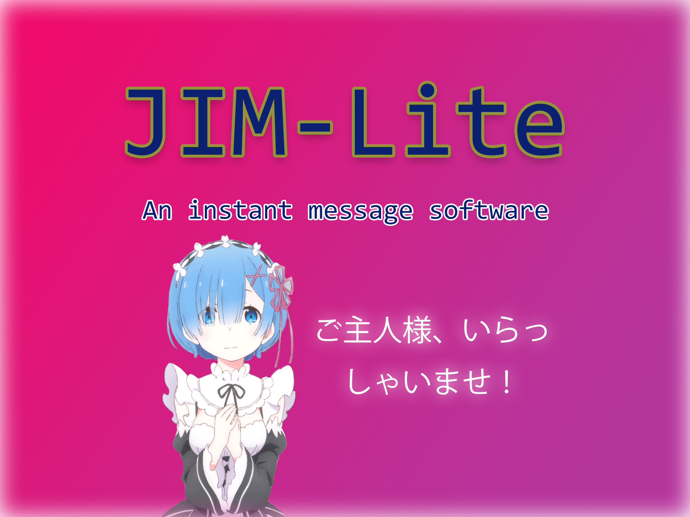

# JIM Lite


```
      _ ___ __  __       _     _ _       
     | |_ _|  \/  |     | |   (_) |_ ___ 
  _  | || || |\/| |_____| |   | | __/ _ \
 | |_| || || |  | |_____| |___| | ||  __/
  \___/|___|_|  |_|     |_____|_|\__\___|
```

This project is the homework of the comprehensive practical course of program design in Capital Normal University. The original intention of this project is to enable instant messaging, so we use [Qt](https://www.qt.io/) to develop it. And we use WebSocket, [SQLite](https://www.sqlite.org/) and JSON format for the project.

## Documentation
* [Demo video](https://www.bilibili.com/video/BV1sT4y1f7ms/)
* [Protocol](docs/protocol.md)

## References
* [BreezeStyleSheets](https://github.com/Alexhuszagh/BreezeStyleSheets) - The UI Library

## License
Open source by [GNU GPLv3.0](https://choosealicense.com/licenses/gpl-3.0/) license.

GitHub: https://github.com/mmdjiji/jim-lite